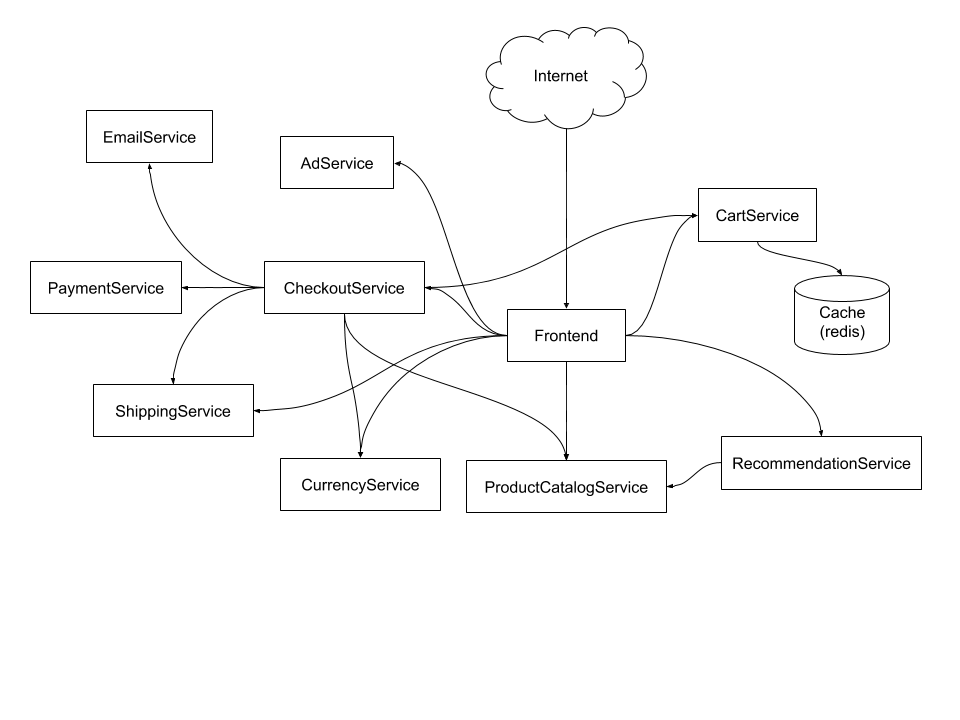
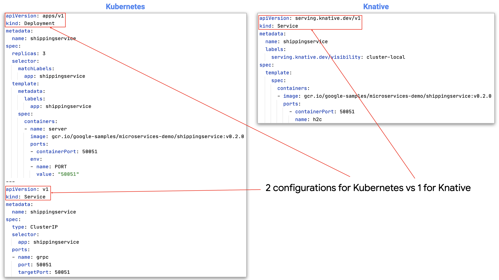
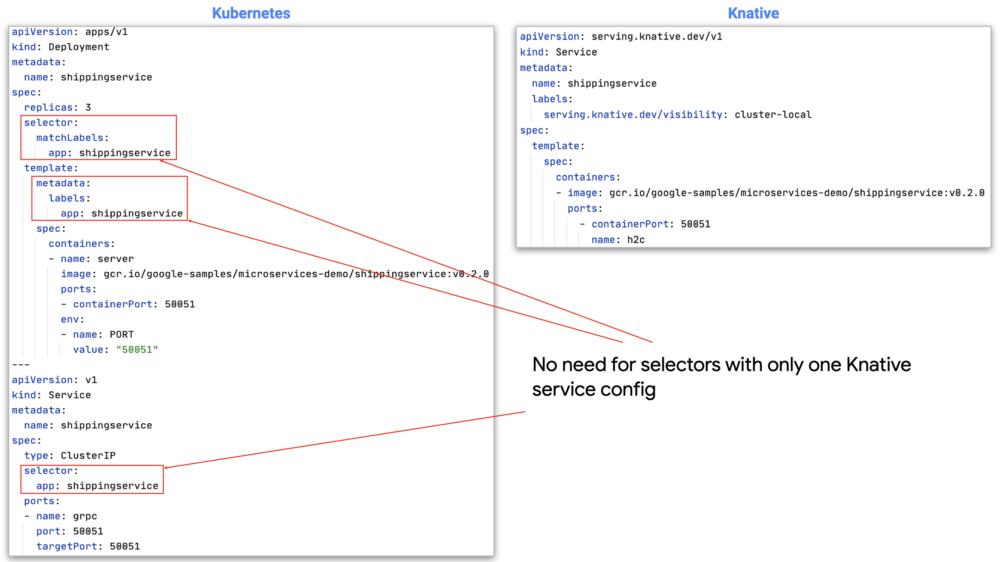
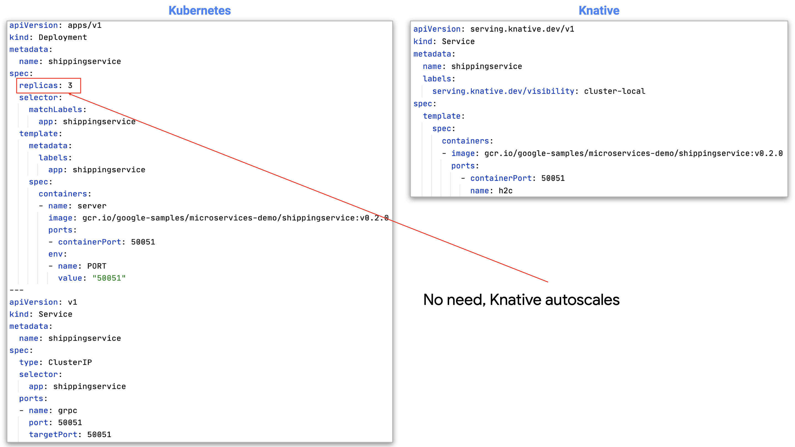
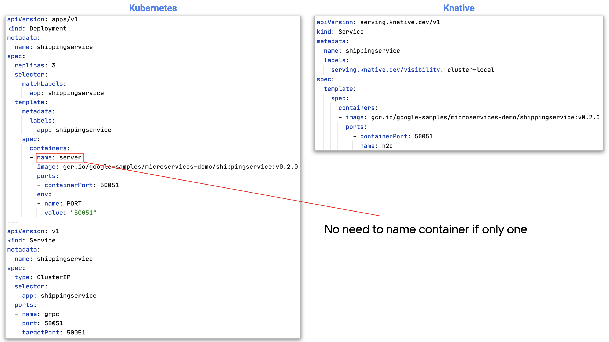
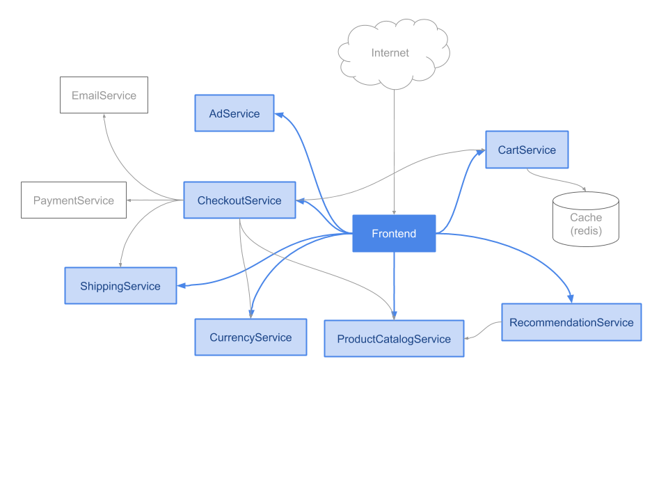

# Knative configuration

This section will help you understand how Knative serverless configuration simplifies deploying services that will run on Kubernetes. You will cover the following:

* You'll take a look at the architecture of the application to be deployed
* You'll learn about which services need to be deployed as conventional services and which can take advantage of serverless
* You'll learn highlighted differences between the two types of configuration
* You'll get a walkthrough of the configuration for the microservices app

## Application architecture

The Online Boutique is an example of a modern microservices architecture. It has a front end for serving the web application, nine other backend microservices for peforming specific application-related functions, and a database backend (in this case, Redis as an in-memory data store).

_Microservice application architecture_



## Knative services

Knative makes it easer to run certain kinds of services on Kubernetes. Knative implements functionality on top of Kubernetes clusters to:

* run stateless workloads
* support event subscription, delivery, and handling

This tutorial covers the first category, called [Knative Serving]. This is implemented as a [Kubernetes controller] that was installed as an addon when you created a cluster in the last section.

Knative registers its own API types to the Kubernetes API, so working with it is familiar, and it makes running stateless services on Kubernetes easier by making autoscaling, networking and rollouts easier using a simplified serverless configuration model.

### Stateful services

In the architecture diagram above, the database is not a candidate for running with Knative since it is a stateful service that [requires access to a volume]. With Knative Serving, all volume mounts are disallowed except for ConfigMaps and Secrets. Stateless services under Knative Serving are expected to be able to scale horizontally and having shared state in volumes would severely impede that goal.

### Stateless services

All of the other services typify stateless microservices. None of them implement long running tasks that could potentially time out (by default, [ten minutes]) before completing a request under Knative Serving, so they are ideal serverless candidates.

## Configuration overview

If you're familiar with Kubernetes configuration, you'll appreciate how much Knative simplifies things. When migrating microservice demo's manifests from Kubernetes to Knative, we can streamline the configuration quite a bit, as shown below for the `shippingservice`.

For one thing, there is no need for two separate resource type configurations to deploy a Knative service; the Kubernetes `Service` and `Deployment` configuration can be specified with a single Knative `Service` resource type.



And since there is no need to correlate the two types of resources, you can therefore dispense with the selectors and labels as well:




Thanks to smart autoscaling, there is no need to specify the number of replicas:



If the service will only have one container, then there is need to give it a name:



## Configuration details

Next, let's review the service manifests for the microservice demo app, starting with the `frontend` service. The explanations build on each other to minimize redundancy.

## frontend

The `frontend` service is exposed to the Internet, serves the web user interface, and communicates with seven backend services.



### [services.yaml](https://github.com/subfuzion/cloud-run-for-anthos-labs/blob/master/labs/101-deploy-a-microservices-app/knative/v1/services.yaml#L143-L174) → frontend

```
apiVersion: serving.knative.dev/v1
kind: Service
metadata:
  name: frontend
spec:
  template:
    spec:
      containers:
        - image: gcr.io/google-samples/microservices-demo/frontend:v0.2.0
          env:
            - name: PRODUCT_CATALOG_SERVICE_ADDR
              value: "productcatalogservice.default:80"
            - name: CURRENCY_SERVICE_ADDR
              value: "currencyservice.default:80"
            - name: CART_SERVICE_ADDR
              value: "cartservice.default:80"
            - name: RECOMMENDATION_SERVICE_ADDR
              value: "recommendationservice.default:80"
            - name: SHIPPING_SERVICE_ADDR
              value: "shippingservice.default:80"
            - name: CHECKOUT_SERVICE_ADDR
              value: "checkoutservice.default:80"
            - name: AD_SERVICE_ADDR
              value: "adservice.default:80"
          resources:
            requests:
              cpu: 100m
              memory: 64Mi
            limits:
              cpu: 200m
              memory: 128Mi

```

There are a number of important things to note about this [service configuration] are:

* The first two lines identify this configuration as a Knative `Service` using the Knative Serving API (`serving.knative.dev/v1`).
* The name for the resource, which must be unique within a namespace, is supplied in metadata: `frontend`. Since no namespace is supplied, the default is "`default`".
* There's only one container image for the service, so the container doesn't need to be named: : `gcr.io/google-samples/microservices-demo/frontend:v0.2.0`.
* The `frontend` service expects environment variables with `dnsname:port` values to be set for each of the backend services that it will send requests to. Note that all of these services are also in the `default` namespace as indicated by their DNS names.
* The Kubernetes [compute resource requirements] for the container are specified: at least 10% of a vCPU (limited to 20%) and at least 64 MiB (67,108,864 bytes, with a limit double that, or 134,217,728 bytes).
* Since the `frontend` service listens on the port identified at runtime with the `PORT` environment variable (which is [automatically set by Knative]), there is no need to specify a `containerPort` value, as some of the other services in the app. The default for `PORT` is `8080`, but it's a good practice for a Knative service to get the value of the `PORT` environment variable anyway.
* The `frontend` service will be published to an external (public) IP address. This is the default behavior for Knative, unless services are made private, as explained for the next service.

## adservice

The `frontend` fetches short text advertisements to display from `adservice` by sending a list of important key words from the current page describing context. 

### [services.yaml](https://github.com/subfuzion/microservices-demo-knative/blob/master/manifests/kn/1/services.yaml#L14-L35) → adservice

```
apiVersion: serving.knative.dev/v1
kind: Service
metadata:
  name: adservice
  labels:
    serving.knative.dev/visibility: cluster-local
spec:
  template:
    spec:
      containers:
      - image: gcr.io/google-samples/microservices-demo/adservice:v0.2.0
        ports:
          - containerPort: 8080
            name: h2c
        resources:
          requests:
            cpu: 200m
            memory: 180Mi
          limits:
            cpu: 300m
            memory: 300Mi
```

There are two important things to note:

* In addition to the name, there is metadata used to configure the service's visibility as `cluster-local`. This means there is no public access to the adservice; this is a [private cluster-local service] that is only accessible from within the cluster.
* The `containerPort` is set to `8080`. While this is actually the default Knative value anyway, it is still necessary to provide the full `containerPort` spec in this case because this service (and all of other remaining Knative services in this demo other than `frontend`) use gRPC, a high performance RPC framework over HTTP/2. To specify this, the `containerPort` value for `name` must be set to `h2c` (HTTP/2 over TCP); if this is not provided, then the [default for Knative is HTTP/1].

## cartservice

The `cartservice` provides shopping cart functionality for the app. 

### [services.yaml](https://github.com/subfuzion/cloud-run-for-anthos-labs/blob/master/labs/101-deploy-a-microservices-app/knative/v1/services.yaml#L36-L63) → cartservice

```
apiVersion: serving.knative.dev/v1
kind: Service
metadata:
  name: cartservice
  labels:
    serving.knative.dev/visibility: cluster-local
spec:
  template:
    spec:
      containers:
      - image: gcr.io/google-samples/microservices-demo/cartservice:v0.2.0
        args: ["-p", "$(PORT)"]
        ports:
          - containerPort: 8080
            name: h2c
        env:
          - name: LISTEN_ADDR
            value: "0.0.0.0"
          - name: REDIS_ADDR
            value: "redis-cart:6379"
        resources:
          requests:
            cpu: 200m
            memory: 64Mi
          limits:
            cpu: 300m
            memory: 128Mi
```

The configuration should look familiar now; the only a couple of things to note here:

* The `cartservice` takes a `port` option (`-p`); the option's value is supplied using the value of the `PORT` environment variable set by Knative. The `cartservice` determines the specific network interface to listen on using the `LISTEN_ADDR` environment variable.
* It communicates with the data store backend using the address supplied with the `REDIS_ADDR` environment variable.

## checkoutservice

The `checkoutservice` is used to purchase the items a customer has added to their cart. 

### [services.yaml](https://github.com/subfuzion/cloud-run-for-anthos-labs/blob/master/labs/101-deploy-a-microservices-app/knative/v1/services.yaml#L64-L98) → checkoutservice

```
apiVersion: serving.knative.dev/v1
kind: Service
metadata:
  name: checkoutservice
  labels:
    serving.knative.dev/visibility: cluster-local
spec:
  template:
    spec:
      containers:
      - image: gcr.io/google-samples/microservices-demo/checkoutservice:v0.2.0
        ports:
          - containerPort: 8080
            name: h2c
        env:
          - name: PRODUCT_CATALOG_SERVICE_ADDR
            value: "productcatalogservice.default:80"
          - name: SHIPPING_SERVICE_ADDR
            value: "shippingservice.default:80"
          - name: PAYMENT_SERVICE_ADDR
            value: "paymentservice.default:80"
          - name: EMAIL_SERVICE_ADDR
            value: "emailservice.default:80"
          - name: CURRENCY_SERVICE_ADDR
            value: "currencyservice.default:80"
          - name: CART_SERVICE_ADDR
            value: "cartservice.default:80"
        resources:
          requests:
            cpu: 100m
            memory: 64Mi
          limits:
            cpu: 200m
            memory: 128Mi
```

Like the `frontend` and `cartservice`, the checkout service uses environment variables to get the addresses to use for the backend services it needs to communicate with.

## currencyservice

The `currencyservice` is used to convert currencies to display price. 

### [services.yaml](https://github.com/subfuzion/cloud-run-for-anthos-labs/blob/master/labs/101-deploy-a-microservices-app/knative/v1/services.yaml#L99-L120) → currencyservice

```
apiVersion: serving.knative.dev/v1
kind: Service
metadata:
  name: currencyservice
  labels:
    serving.knative.dev/visibility: cluster-local
spec:
  template:
    spec:
      containers:
      - image: gcr.io/google-samples/microservices-demo/currencyservice:v0.2.0
        ports:
          - containerPort: 7000
            name: h2c
        resources:
          requests:
            cpu: 100m
            memory: 64Mi
          limits:
            cpu: 200m
            memory: 128Mi
```

The `currencyservice` listens on a specific port (`7000`), so this needs to be specified, along with the name `h2c` for gRPC communication.

## emailservice

The `emailservice` sends ordering and payment confirmation after a purchase. 

### [services.yaml](https://github.com/subfuzion/cloud-run-for-anthos-labs/blob/master/labs/101-deploy-a-microservices-app/knative/v1/services.yaml#L121-L142) → emailservice

```
apiVersion: serving.knative.dev/v1
kind: Service
metadata:
  name: emailservice
  labels:
    serving.knative.dev/visibility: cluster-local
spec:
  template:
    spec:
      containers:
      - image: gcr.io/google-samples/microservices-demo/emailservice:v0.2.0
        ports:
          - containerPort: 8080
            name: h2c
        resources:
          requests:
            cpu: 100m
            memory: 64Mi
          limits:
            cpu: 200m
            memory: 128Mi
```

It's already been mentioned previously, but the only reason for the explicit `containerPort` configuration (since it uses the default port value) is to specify the name `h2c`, which is used for gRPC (HTTP/2 over TCP).

## paymentservice

The `paymentservice` is used for making purchases at checkout. 

### [services.yaml](https://github.com/subfuzion/cloud-run-for-anthos-labs/blob/master/labs/101-deploy-a-microservices-app/knative/v1/services.yaml#L175-L196) → paymentservice

```
apiVersion: serving.knative.dev/v1
kind: Service
metadata:
  name: paymentservice
  labels:
    serving.knative.dev/visibility: cluster-local
spec:
  template:
    spec:
      containers:
      - image: gcr.io/google-samples/microservices-demo/paymentservice:v0.2.0
        ports:
          - containerPort: 8080
            name: h2c
        resources:
          requests:
            cpu: 100m
            memory: 64Mi
          limits:
            cpu: 200m
            memory: 128Mi

```

Nothing new to explain here.

## productcatalogservice

The `productcatalogservice` is used to convert currencies to display price. 

### [services.yaml](https://github.com/subfuzion/cloud-run-for-anthos-labs/blob/master/labs/101-deploy-a-microservices-app/knative/v1/services.yaml#L197-L218) → productcatalogservice

```
apiVersion: serving.knative.dev/v1
kind: Service
metadata:
  name: productcatalogservice
  labels:
    serving.knative.dev/visibility: cluster-local
spec:
  template:
    spec:
      containers:
        - image: gcr.io/google-samples/microservices-demo/productcatalogservice:v0.2.0
          ports:
            - containerPort: 3550
              name: h2c
          resources:
            requests:
              cpu: 100m
              memory: 64Mi
            limits:
              cpu: 200m
              memory: 128Mi
```

The `productcatalogservice` listens on a specific port (`3550`), so this needs to be specified, along with the name `h2c` for gRPC communication.

## recommendationservice

The `recommendationservice` is used to make similar product recommendations while browsing. 

### [services.yaml](https://github.com/subfuzion/cloud-run-for-anthos-labs/blob/master/labs/101-deploy-a-microservices-app/knative/v1/services.yaml#L219-L243) → recommendationservice

```
apiVersion: serving.knative.dev/v1
kind: Service
metadata:
  name: recommendationservice
  labels:
    serving.knative.dev/visibility: cluster-local
spec:
  template:
    spec:
      containers:
      - image: gcr.io/google-samples/microservices-demo/recommendationservice:v0.2.0
        ports:
          - containerPort: 8080
            name: h2c
        env:
          - name: PRODUCT_CATALOG_SERVICE_ADDR
            value: "productcatalogservice.default:80"
        resources:
          requests:
            cpu: 100m
            memory: 220Mi
          limits:
            cpu: 200m
            memory: 450Mi
```

Nothing new to explain here.

## shippingservice

The `shippingservice` is used to ship purchased products. 

### [services.yaml](https://github.com/subfuzion/cloud-run-for-anthos-labs/blob/master/labs/101-deploy-a-microservices-app/knative/v1/services.yaml#L244-L265) → shippingservice

```
apiVersion: serving.knative.dev/v1
kind: Service
metadata:
  name: shippingservice
  labels:
    serving.knative.dev/visibility: cluster-local
spec:
  template:
    spec:
      containers:
      - image: gcr.io/google-samples/microservices-demo/shippingservice:v0.2.0
        ports:
          - containerPort: 50051
            name: h2c
        resources:
          requests:
            cpu: 100m
            memory: 64Mi
          limits:
            cpu: 200m
            memory: 128Mi
```

The `shippingservice` listens on a specific port (`3550`), so this needs to be specified, along with the name `h2c` for gRPC communication.


[automatically set by Knative]: https://github.com/knative/serving/blob/master/docs/runtime-contract.md#process
[compute resource requirements]: https://kubernetes.io/docs/reference/generated/kubernetes-api/v1.18/#resourcerequirements-v1-core
[default for Knative is HTTP/1]: https://github.com/knative/serving/blob/master/docs/runtime-contract.md#protocols-and-ports
[Knative Serving]: https://knative.dev/docs/serving/
[Kubernetes controller]: https://kubernetes.io/docs/concepts/architecture/controller/
[requires access to a volume]: https://github.com/subfuzion/microservices-demo-knative/blob/master/manifests/k/redis-cart.yaml#L41
[service configuration]: https://knative.dev/docs/reference/serving-api/#serving.knative.dev/v1.Service
[ten minutes]: https://github.com/knative/serving/blob/master/pkg/apis/config/defaults.go#L46
[private cluster-local service]: https://knative.dev/docs/serving/cluster-local-route/

---
[[toc]](README.md) [[back]](02-setting-up.md) [[next]](04-deploy-the-app.md)
