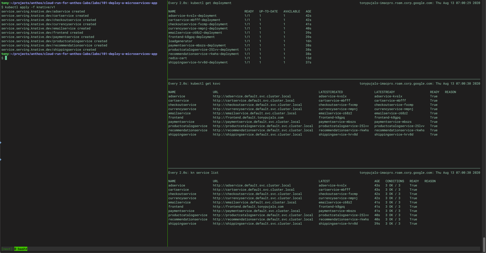
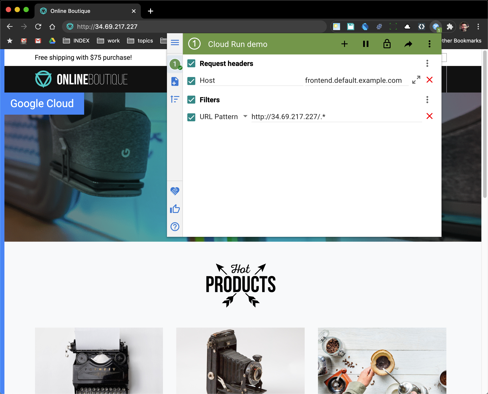

# Deploy the application

For this section you might want to open two additional terminal windows or, if you're using a screen manager like [tmux], to open two additional panes in your terminal. The second window or pane will be useful for monitoring **all** the resources deployed on Kubernetes; the third will be useful for monitoring specifically the resources deployed as Knative services.

In the second terminal window or pane, run the following command:

```
watch kubectl get deployment
```

In the third terminal window or pane, run:


```
watch kubectl get ksvc
```

## Steps

1. Deploy the data store (redis) backend:

```
kubectl apply -f kubernetes/redis-cart.yaml
```

2. Deploy the rest of the application as Knative services:

```
kubectl apply -f knative/v1
```

## Viewing the app for the first time

If you were running a watch for `kubectl get ksvc` in another terminal window or pane, you will see URLs for each of the deployed Knative services. By default, the domain is `example.com`, so the `frontend`'s fully qualified domain name (FQDN) should be  `frontend.default.example.com`, while all of the private (cluster local) services should be `{name}.default.svc.cluster.local`.



All traffic, internal and external, go through ingress gateways ([Envoy] proxies, by default) to provide the load balancing and traffic routing/splitting support for your application. If you run the following command, you can see information about the external-facing (`istio-ingress`) and internal-facing (`cluster-local-gateway) `objects created for Cloud Run for Anthos.

```
kubectl get svc -n gke-system
```

Example output:

```
NAME                    TYPE           CLUSTER-IP    EXTERNAL-IP     PORT(S)                                      AGE
cluster-local-gateway   ClusterIP      10.8.9.102    <none>          15020/TCP,80/TCP,443/TCP                     1d
istio-ingress           LoadBalancer   10.8.13.245   34.69.217.227   15020:30372/TCP,80:30070/TCP,443:30813/TCP   1d
```

1. Get the Knative gateway IP:

```
kubectl get svc istio-ingress --namespace gke-system
```

2. Get the URL for the Knative route for `frontend`:

```
kubectl get route frontend
```

3. Confirm access

Try running the following command (note for `Host` you only use the FQDN without the `http://` URL prefix), substituting as appropriate with the information from the first two steps:

```
curl -H "Host: frontend.default.example.com" 34.69.217.227
```


If all went well, you should see a bunch of HTML output in your terminal. If not, check the status of the services you deployed and ensure they are all ready.

### Viewing the app in a browser

Since you don't own the default domain (`example.com`), you won't be able to configure DNS records for it to have it resolve to your app's IP address . The solution is configure domain mapping for a domain you own. But if you just want to quickly test the app on your own system, keep reading, otherwise skip ahead to custom domain mapping.

To view the app in a browser, you need to ensure that the request identifies the correct host either from the URL that you enter in the browser or else contains an HTTP header with the correct host (as shown above with the `curl ` example ) so that the ingress gateway can route the request correctly. Until you map a custom domain, there are a couple of tricks you can use.
  
#### Edit your local `/etc/hosts` file

With this method, you'll update your local `/etc/hosts` file so that URL can resolve to an IP address on your system. You will need to have `sudo` access on your system to do this.

1\. Get the Knative gateway IP:

This is similar to what you used in the `curl` example earlier, but this time we'll save the IP to a variable.

```
IP=$(kubectl get svc istio-ingress --namespace gke-system --output jsonpath="{.status.loadBalancer.ingress[*]['ip']}")
```

2\. Get the DNS name from the URL for the Knative route to the `frontend
 ` service:

```
NAME=$(kubectl get route frontend --output jsonpath="{.status.url}" | cut -d'/' -f 3)
```

3\. Run the following to append an entry to your local `/etc/hosts` file.

```
echo -e "$IP\t$NAME" | sudo tee -a /etc/hosts
```

You should edit your `/etc/hosts` file to remove this entry when you no longer need it.

#### Add a chrome extension to your browser

This technique works with the Chrome browser. Use an extension that allows
 you to set an HTTP header for the host like we did with the `curl` example
 . Read this [article] about how to add and use the `ModHeader` chrome extension.

When you configure the extension, also add a filter for the URL pattern so
 that the header is only modified for requests specifically to the IP address
 for the app. See the screenshot below:



### Custom domain mapping

Previously you saw a couple of ways to quickly test your app without setting up a custom domain. At some point, however, you'll want to be able to publish the app under a domain name that you control.

You will want to read the docs for [Setting up a custom domain].

To help you get started with the domain configuration config-map, there is a template under the `configmaps` directory [config-domain.example.yaml](configmaps/config-domain.example.yaml) that you can copy to `config-domain.yaml` and edit. After you replace `example.com` with the domain name you want to use, you can apply the config-map:
    
```
kubectl apply -f configmaps/config-domain.yaml
```
  
Then, follow the steps at [Publish your Domain] to update your DNS records.


[article]: https://infoheap.com/chrome-add-custom-http-request-headers/
[Envoy]: https://envoyproxy.io/
[Publish your Domain]: https://knative.dev/docs/serving/using-a-custom-domain/#publish-your-domain
[Setting up a custom domain]: https://knative.dev/docs/serving/using-a-custom-domain/
[tmux]: https://github.com/tmux/tmux/wiki

---
[[toc]](README.md) [[back]](03-knative-configuration.md) [[next]](05-autoscaling.md)
