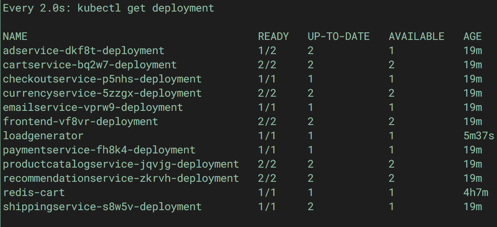

# Autoscaling

## Scale to zero

After deploying the app, one of the things you may notice as you navigate to various pages is that some of the pages take a short while to start up while the services that back that page are started. This is because by default Knative services scale to zero after a period of inactivity. Being able to scale to zero is a desirable trait for infrequently used services that don't need to run constantly and incur billing. After scaling down, the start delay is experienced only until the service is running again until the next period of inactivity.

For services backing the user interface where these delays are unacceptable, the solution is to disable scale to zero globally or to set the minimum scale on a per service basis.

Under the `configmaps` directory there is a `config-scaling.yaml` file that can be applied to disable scale to zero globally (`kubectl apply -f configmaps/config-scaling.yaml`). Depending on your application, this may be perfectly appropriate or a bit too heavy-handed of an approach to take.

The alternative is to set `minScale` to one on a per service base using this configuration:

```
spec:
  template:
    metadata:
      annotations:
        autoscaling.knative.dev/minScale: "1"
```

If you apply the services configuration under `knative/v2`, you can see the result of this minimum scaling applied to all of the services for the app. Once you confirm that all the services are running, test the app again. It should feel much more snappy and responsive now.

```
kubectl apply -f knative/v2
```

## Scaling up

You services automatcially scale up. As with `minScale` above, you can also configure a `maxScale` limit, if you need to.
 
To demonstrate scaling up, you can apply the configuration under `knative/v3`. You normally should not need to do this, but in the configuration a hard limit on container concurrency has been set to limit one request per container at a time to force scaling up.
  
```
kubectl apply -f knative/v3
```

Next, you can run a load generator service that will simulate sending requests from multiple users simultaneousy. If you look at the configuration (`kubernetes/loadgenerator.yaml`), you'll see that the `USERS` environment variable has been set to `10`. The app responds quickly enough we need enough requests to trigger scaling.
    
```
kubectl apply -f kubernetes/loadgenerator.yaml
```

If you look at the terminal window or pane that's monitoring the kubernetes deployments (`watch kubectl get deployment`), you'll notice after a short while (around a minute), the number of replicas will begin to increase (the `READY` column displays replicas in `ready`/`desired` format).
   


Why isn't `loadgenerator` deployed as a Knative service? If you recall, we explained in [Knative configuration] that `redis-cart` couldn't be deployed with Knative since it was a stateful service that required access to a volume.

This isn't the case with `loadgenerator`, however. The reason is because `loadgenerator` is intended to be a long-running service that continues to send requests to generate load until it's terminated. If left running, it would eventually time out after [ten minutes].
      
If you only want to generate load for short periods of time, then the configuration could be modified as described in [Knative configuration] and redeployed . This exercise is left up to you. ☺️

[Knative configuration]: 03-knative-configuration.md
[ten minutes]: https://github.com/knative/serving/blob/master/pkg/apis/config/defaults.go#L46

---
[[toc]](README.md) [[back]](04-deploy-the-app.md) [[next]](06-cleanup.md)

